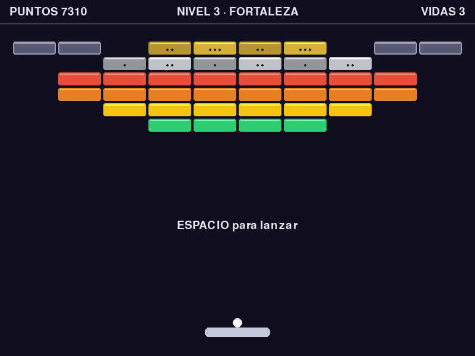

# Arkanoid

Clon de Arkanoid / Breakout hecho en Python con [pygame-ce](https://pyga.me/).
Paleta, pelota, ladrillos de varios tipos, cápsulas de power-up y cinco diseños de
nivel que se repiten en bucle subiendo la dificultad.



## Requisitos

- Python 3.10 o superior (probado con 3.14)
- pygame-ce >= 2.5.5

## Instalación y ejecución

```bash
pip install -r requirements.txt
python main.py
```

## Controles

| Tecla | Acción |
|---|---|
| ← → o A / D | Mover la paleta |
| ESPACIO | Lanzar la pelota / empezar / continuar |
| P o ESC | Pausa |
| Q (en pausa) | Volver al menú |
| ESC (en el menú) | Salir |

## Cómo se juega

Rompe todos los ladrillos sin que la pelota se te escape. El **ángulo de salida
depende de dónde golpea la pelota en la paleta**: por el centro sale recta, por los
extremos sale muy abierta. Ése es todo tu control de puntería.

### Ladrillos

| Ladrillo | Golpes | Puntos |
|---|---|---|
| De color (rojo → morado) | 1 | 70 → 20 |
| Plata | 2 | 90 |
| Dorado | 3 | 130 |
| Gris | indestructible | — |

Los ladrillos duros se oscurecen al recibir golpes y muestran un punto por cada golpe
que les queda. Cada 3 niveles aguantan uno más (hasta +2). Los grises no se rompen
nunca: el nivel termina cuando no queda ningún ladrillo *rompible*.

### Cápsulas

Al romper un ladrillo puede caer una cápsula. Atraparla con la paleta da 50 puntos y
su efecto (12 segundos los temporales):

| | Efecto |
|---|---|
| **E** | Paleta ancha |
| **R** | Paleta estrecha — la única mala |
| **L** | Pelota lenta |
| **M** | Multi-bola: dos pelotas extra |
| **C** | Atrapa: la pelota se pega a la paleta, ESPACIO la relanza |
| **V** | Vida extra (máximo 5) |

Perder una vida cancela todos los efectos activos.

### Niveles

Cinco diseños —CLÁSICO, PIRÁMIDE, FORTALEZA, DAMERO y TÚNEL— que se recorren en orden
y vuelven a empezar. Cada nivel añade un 10 % de velocidad a la pelota.

## Estructura

| Archivo | Qué contiene |
|---|---|
| [`settings.py`](settings.py) | Todos los ajustes: tamaños, velocidades, colores, tipos de ladrillo y diseños de nivel |
| [`entities.py`](entities.py) | `Paddle`, `Brick`, `Ball` y `PowerUp`: se mueven, chocan y se dibujan |
| [`main.py`](main.py) | `Game`: bucle principal, estados, puntuación, vidas y reglas |

Para crear un nivel nuevo no hace falta tocar código: basta con añadir un diseño de
texto a `LEVEL_LAYOUTS` en `settings.py`.

## Desarrollo por fases

El juego se construyó en fases y cada una está documentada en
[FASES.md](FASES.md): qué se añadió, por qué y cómo se comprobó.
